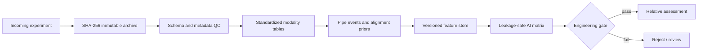

# Pipe Stress Data Magnetic Sensing Platform

[中文说明](README_CN.md) · [P110 magnetic + strain case](case_studies/p110_magnetic_strain/README.md) · [406 multimodal case](case_studies/406_multimodal/README.md) · [Demo](demo/README.md) · [AI data contract](docs/AI_DATA_CONTRACT.md) · [Acquisition SOP](docs/工业采集元数据SOP.md)

A traceable data pipeline for magnetic, remanence, eddy-current and strain-gauge pull-test data used in pipeline-stress research. It turns scattered CSV/XLSX/native acquisition files into immutable assets, typed tables, quality-control records, versioned features and leakage-safe AI inputs.

> Research/engineering foundation. Quantitative MPa output remains fail-closed until a frozen model passes independent-pipe blind validation.

## Two real-data case studies

| P110 magnetic + strain | 406 MEM/remanence/ETP |
|---|---|
| [](case_studies/p110_magnetic_strain/README.md) | [](case_studies/406_multimodal/README.md) |
| **Actual data:** three-axis magnetic probes and strain gauges. No independent remanence measurement and no ETP. Reviewed two-run evidence supports relative ordering only; direct MPa remains disabled. | **Actual data:** shared MEM/remanence magnetic arrays, independent ETP in blind repeats, and strain gauges in calibration. Fusion remains QC-gated; no blind MPa is claimed. |
| [Open P110 case](case_studies/p110_magnetic_strain/README.md) · [Real data v0.2.0](https://github.com/dctthree/pipe-stress-data-platform/releases/tag/v0.2.0) · [Field photos](docs/results/field_photos/README.md) | [Open 406 case](case_studies/406_multimodal/README.md) · [Real data v0.3.0](https://github.com/dctthree/pipe-stress-data-platform/releases/tag/v0.3.0) · [Field photos](docs/results/field_photos/406/README.md) |

Both cards above use real experimental results, not the synthetic reader demo. The two experiments share the traceable platform but retain separate measurement contracts, configurations, evidence and claim limits.

## Experimental scope

| Campaign | Available measurements | Design and truth boundary |
|---|---|---|
| P110 EXP2 | Three-axis magnetic probes + strain gauges | Two complete repeated runs in the published package. No independent remanence dataset and no ETP data. |
| 406 calibration | One shared magnetic CSV stream split by verified physical-column parity into MEM and remanence groups + strain gauges | Zero load S0 plus six loaded states S1–S6. Reported MPa values are `206 GPa × median bending strain`, not load-cell truth. No stage-matched ETP calibration data. |
| 406 blind repeats | The same shared MEM/remanence magnetic stream + an independent 20-channel complex ETP stream | C1 and C2 are complete S0–S6; C3 contains S0–S2 only: 17 paired packets. No contemporaneous strain/MPa truth. |

The modality boundaries are deliberate. In the 406 magnetic files, 32 physical columns each carry 10 sensing positions. One-based odd physical columns are the 160 remanence channels and even physical columns are the 160 MEM channels. They are two sensor groups inside the same 1307-field magnetic CSV—not two separately acquired files. ETP is independently acquired.

## Real 406 evidence

### Test setup

| In-line inspection tool and test pipe | Four-point-bending and strain-gauge arrangement |
|---|---|
|  |  |

The photographs provide physical context only and are not analysis inputs. Browser copies are colour-normalized, resized and stripped of metadata; provenance and the background-person privacy note are recorded in the [photo notes](docs/results/field_photos/406/README.md).

### Calibration and repeatability

The first figure is generated from the real 406 calibration run and its strain-gauge-derived nominal bending stress. It is useful development evidence, but it is one calibration sequence and must not be interpreted as independent validation.


The second figure shows all available blind-repeat packets. It deliberately retains the C2/S2 operator/QC rejection and the partial C3 trajectory instead of hiding them.


The most defensible engineering policy is:

- `MAG-F1-DW-Q90-v1` from remanence X is the primary same-pipe, same-session relative-order/change feature. After excluding the pre-declared C2/S2 QC failure, C1↔C2 gives Spearman ρ = 1.000, Lin's CCC = 0.996 and normalized RMSE = 3.35%.
- `MEM-F4-ZSD-v1` is an unsigned auxiliary check that requires the zero-load scan from the same cycle; strict C1↔C2 CCC = 0.980 and normalized RMSE = 7.51%.
- ETP candidates remain research/QC evidence. Their negative controls can be as strong as the target response, so ETP must not be promoted to a stress quantity from this dataset.
- The current fusion code is fail-closed modality/QC eligibility gating. Because ETP does not pass its cohort gates, outputs remain magnetic-relative-only; no numeric fusion or blind MPa is produced. Explicit stagewise cross-modality conflict scoring is a required future gate, not an implemented result in this release.

See the [406 case study](case_studies/406_multimodal/README.md) for formulas, all derived tables, 13 reproducible blind-repeat figures, one frozen calibration figure with redraw data/code, MATLAB source and validation rules.

## Real P110 evidence

P110 EXP2 contains magnetic-probe and strain-gauge measurements only. Probe names that mention a magnetizing section describe hardware conditions, not an independently acquired remanence modality.


Five preselected magnetic sensors in the reviewed X-axis workflow reproduce stress ordering in two complete-bilateral-MEM runs, while their direct linear slopes differ substantially. Conservative whole-trace QC and the later X-axis-specific review do not assign identical status, so this remains an exploratory relative-ordering candidate—not a set of universally certified channels or a direct-MPa calibration. See the [complete P110 case](case_studies/p110_magnetic_strain/README.md) and [field-photo notes](docs/results/field_photos/README.md).

## Why this repository exists

Real pull-test campaigns mix sensor fragments, strain exports, loading notes, repeated states and manually named folders. That makes it easy to overwrite raw data, align the wrong stage, reuse blind labels during feature selection or treat sample-domain frequencies as physical Hz without a sample rate.



Included capabilities:

- content-addressed raw archives and SHA-256 deduplication;
- config-driven magnetic layouts and explicit 406 parity/channel contracts;
- streaming XLSX and large fragmented-CSV handling;
- pipe-entry, weld and pipe-exit registration with geometry-aware QC;
- clipping, sentinel, temperature, continuity and negative-control checks;
- versioned features, separate labels and grouped AI split keys;
- CSV, Parquet, SQLite, MATLAB and Python interfaces;
- frozen releases and machine-readable dataset fingerprints.

## Public data releases

Raw experimental files are excluded from Git history and published as immutable Release assets.

| Release | Contents | Entry point |
|---|---|---|
| [v0.2.0](https://github.com/dctthree/pipe-stress-data-platform/releases/tag/v0.2.0) | Full P110 EXP2 magnetic + strain package | `dataset_index.json` inside `P110_EXP2_full_release_1.0.0+97b0dca62768.zip` |
| [v0.3.0](https://github.com/dctthree/pipe-stress-data-platform/releases/tag/v0.3.0) | 406 calibration MEM/remanence + strain, and 17-packet blind MEM/remanence/ETP data | `release_index.json`, `raw_file_manifest.csv` and `SHA256SUMS.txt` |

Do not infer stages by scanning filenames. Start from the published index and preserve missing stages and QC failures exactly as recorded.

## Quick structural demo

The small demo is deterministic, de-identified, magnetic-only P110-like data. It tests the reader and pipeline structure; it is not experimental evidence.

```powershell
python -m pip install -e ".[demo]"
python demo/run_demo.py --regenerate
```


## Run on a local experiment

1. Copy [configs/experiment_template.json](configs/experiment_template.json).
2. Register the pipe, probe layout, run/stage mapping and signal schema.
3. Keep verified labels in a separate CSV; leave stress blank for blind data.
4. Run:

```powershell
python run_pipeline.py run --config path/to/experiment.json --output lake --snapshot-mode blob
python run_pipeline.py validate --output lake --full-hash
```

AI clients should use `lake/dataset_index.json` rather than scanning source folders. MATLAB R2024b can use:

```matlab
addpath('matlab');
d = loadStressDataset('lake/dataset_index.json');
```

## Claim limits

- A same-pipe repeat demonstrates repeatability, not transfer to a new pipe.
- Without a physical encoder and speed verification, normalized position is not metre-scale distance.
- Without sampling rate, sample-domain roughness is not a frequency in Hz.
- A QC-rejected primary signal cannot be rescued by another modality.
- Relative changes cannot identify total residual stress from a single scan.
- Direct MPa output remains disabled until calibration, uncertainty and independent blind validation are frozen.

Tracked in Git: code, schemas, templates, tests, compact derived tables, figures and documentation. Raw experimental files and large release archives stay in GitHub Releases. No open-source licence is granted by default; see [NOTICE.md](NOTICE.md).
