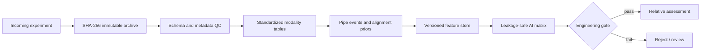

# Pipe Stress Sensing Benchmark & Data Platform

[](https://github.com/dctthree/pipe-stress-data-platform/actions/workflows/ci.yml)
[](https://github.com/dctthree/pipe-stress-data-platform/releases/latest)
[](pyproject.toml)
[](matlab/loadStressDataset.m)
[](LICENSE)
[](DATA_LICENSE.md)
[](https://doi.org/10.5281/zenodo.22162166)
[](https://doi.org/10.5281/zenodo.22167582)
[](https://doi.org/10.5281/zenodo.22167685)

**Real pull-test data · Reproducible Python/MATLAB workflows · Explicit claim limits**


[中文说明](README_CN.md) · [P110 magnetic + strain case](case_studies/p110_magnetic_strain/README.md) · [406 multimodal case](case_studies/406_multimodal/README.md) · [Related publications](docs/RELATED_PUBLICATIONS.md) · [PIGPROX product materials](docs/product_materials/README.md) · [Demo](demo/README.md) · [AI data contract](docs/AI_DATA_CONTRACT.md) · [Acquisition SOP](docs/工业采集元数据SOP.md)

A traceable data pipeline for magnetic, remanence, eddy-current and strain-gauge pull-test data used in pipeline-stress research. It turns scattered CSV/XLSX/native acquisition files into immutable assets, typed tables, quality-control records, versioned features and leakage-safe AI inputs.

> Research/engineering foundation. Quantitative MPa output remains fail-closed until a frozen model passes independent-pipe blind validation.

## Start here

| Goal | Recommended entry point |
|---|---|
| Inspect real experimental evidence | [P110 magnetic + strain](case_studies/p110_magnetic_strain/README.md) or [406 MEM/remanence/ETP](case_studies/406_multimodal/README.md) |
| Download the frozen real-data packages | [P110 Zenodo dataset](https://doi.org/10.5281/zenodo.22167582) or [406 Zenodo dataset](https://doi.org/10.5281/zenodo.22167685); GitHub mirrors remain at [v0.2.0](https://github.com/dctthree/pipe-stress-data-platform/releases/tag/v0.2.0) and [v0.3.0](https://github.com/dctthree/pipe-stress-data-platform/releases/tag/v0.3.0) |
| Verify the software path quickly | [Deterministic structural demo](demo/README.md) and [CI workflow](.github/workflows/ci.yml) |
| Register a new pull-test campaign | [Experiment template](configs/experiment_template.json) and [acquisition metadata SOP](docs/工业采集元数据SOP.md) |
| Reproduce, question or extend a result | [Open a structured issue](https://github.com/dctthree/pipe-stress-data-platform/issues/new/choose) or join [Discussions](https://github.com/dctthree/pipe-stress-data-platform/discussions) |
| Follow the electromagnetic-ILI research lineage | [Six related peer-reviewed publications with DOI links and BibTeX](docs/RELATED_PUBLICATIONS.md) |
| View the inspection hardware and product collateral | [PIGPROX eddy-current brochure and MEM detector poster](docs/product_materials/README.md) |
| Share the project without overstating its evidence | [Bilingual project share kit](docs/SHARE_KIT.md) |

> **Reuse status:** software is open source under [Apache-2.0](LICENSE). Experimental data, public tables, result figures and field-test photographs are available under [CC BY 4.0](DATA_LICENSE.md) unless stated otherwise. Cite the exact frozen release used.

## Two real-data case studies

| P110 magnetic + strain | 406 MEM/remanence/ETP |
|---|---|
| [](case_studies/p110_magnetic_strain/README.md) | [](case_studies/406_multimodal/README.md) |
| **Experiment:** 10.54 m P110 casing under repeated four-point-bending pulls. The public index contains 48 six-o'clock pulls and five twelve-o'clock pulls; the reviewed complete-bilateral-MEM subset is six-o'clock only. | **Experiment:** 406 mm pipe calibration under four-point bending plus two complete blind pull cycles (C1/C2) and one partial cycle (C3) through the in-line inspection tool. |
| **Sensors:** three-axis magnetic output in `Z/Y/X` order plus strain gauges. The reviewed result uses the complete bilateral MEM probe and preselected sensor IDs 1/3/4/5/6. No independent remanence stream and no ETP. | **Sensors:** 160 remanence and 160 MEM channels separated from one shared magnetic CSV, an independent 20-channel complex ETP stream in blind repeats, and strain gauges in calibration. |
| [](case_studies/p110_magnetic_strain/README.md) | [](case_studies/406_multimodal/README.md) |
| **Current evidence:** two reviewed P110 runs reproduce Q60–Q80 stress ordering, but their response scale differs; direct MPa remains disabled. | **Current evidence:** selected magnetic relative-change candidates survive the declared QC exclusions and same-pipe gates; ETP remains research/QC and no blind MPa is claimed. |
| [Open P110 case](case_studies/p110_magnetic_strain/README.md) · [Data DOI](https://doi.org/10.5281/zenodo.22167582) · [GitHub mirror](https://github.com/dctthree/pipe-stress-data-platform/releases/tag/v0.2.0) · [Field photos](docs/results/field_photos/README.md) | [Open 406 case](case_studies/406_multimodal/README.md) · [Data DOI](https://doi.org/10.5281/zenodo.22167685) · [GitHub mirror](https://github.com/dctthree/pipe-stress-data-platform/releases/tag/v0.3.0) · [Field photos](docs/results/field_photos/406/README.md) |

Both cards above use real experimental results, not the synthetic reader demo. The two experiments share the traceable platform but retain separate measurement contracts, configurations, evidence and claim limits.

## Research lineage and inspection hardware

| Peer-reviewed research | Product presentation |
|---|---|
| The [related-publications index](docs/RELATED_PUBLICATIONS.md) links six papers on compact LC-driven sensing, physics/digital AI, near-zero magnetic sensing, dynamic magnetic coupling, multisensor feature boosting and differential planar-coil eddy-current inspection. DOI links and [BibTeX](docs/related_publications.bib) are included. | The [PIGPROX materials page](docs/product_materials/README.md) provides the original 12-page English eddy-current ILI brochure and the full-resolution MEM ultralight MFL detector poster. |
| [Open publication index](docs/RELATED_PUBLICATIONS.md) | [](docs/product_materials/README.md) |

These are context layers, not extra measurements. The papers remain subject to publisher copyright, and manufacturer specifications in the product collateral are not converted into P110/406 experimental claims.

## Experimental scope

| Campaign | Available measurements | Design and truth boundary |
|---|---|---|
| P110 EXP2 | Three-axis magnetic probes + strain gauges | The full package spans five probe hardware conditions and 53 magnetic scans. The reviewed complete-bilateral-MEM subset contains two full runs. No independent remanence dataset and no ETP data. |
| 406 calibration | One shared magnetic CSV stream split by verified physical-column parity into MEM and remanence groups + strain gauges | Zero load S0 plus six loaded states S1–S6. Reported MPa values are `206 GPa × median bending strain`, not load-cell truth. No stage-matched ETP calibration data. |
| 406 blind repeats | The same shared MEM/remanence magnetic stream + an independent 20-channel complex ETP stream | C1 and C2 are complete S0–S6; C3 contains S0–S2 only: 17 paired packets. No contemporaneous strain/MPa truth. |

The modality boundaries are deliberate. In the 406 magnetic files, 32 physical columns each carry 10 sensing positions. One-based odd physical columns are the 160 remanence channels and even physical columns are the 160 MEM channels. They are two sensor groups inside the same 1307-field magnetic CSV—not two separately acquired files. ETP is independently acquired.

## P110 experimental case — magnetic + strain

### Experiment and sensor setup

| P110 four-point-bending loading rig | Loading head, pipe and strain-gauge wiring |
|---|---|
|  |  |

| Component | Description |
|---|---|
| Pipe and loading | P110 casing, 10.54 m long, 139.70 mm OD and 9.17 mm wall, tested under repeated four-point bending |
| Pull positions | The public scan index contains 48 pulls at 6 o'clock and five single-side-slotted-MEM pulls at 12 o'clock; all reviewed complete-bilateral-MEM rows are from the 6 o'clock tensile side |
| Magnetic sensors | Three-axis CSV order `Z/Y/X`; the reviewed evidence uses the complete bilateral MEM configuration and preselected sensor IDs 1/3/4/5/6 |
| Reference measurement | Matched strain gauges; the plotted MPa values are strain-gauge-derived, not load-cell truth |
| Modality boundary | Magnetic sensor output + strain only; no ETP and no independently acquired remanence stream |

The photographs are real experimental context and are not numerical analysis inputs. Their provenance and metadata-removal record are published in the [P110 photo notes](docs/results/field_photos/README.md).

### Reviewed real analysis

The figure below uses the real reviewed 6 o'clock tensile-side subset. Probe names that mention a magnetizing section describe hardware conditions, not an independently acquired remanence modality.


Five preselected magnetic sensors in the reviewed X-axis workflow reproduce stress ordering in two complete-bilateral-MEM runs, while their direct linear slopes differ substantially. Conservative whole-trace QC and the later X-axis-specific review do not assign identical status, so this remains an exploratory relative-ordering candidate—not a set of universally certified channels or a direct-MPa calibration. See the [complete P110 case](case_studies/p110_magnetic_strain/README.md) and [P110 v0.2.0 data](https://github.com/dctthree/pipe-stress-data-platform/releases/tag/v0.2.0).

## 406 experimental case — MEM/remanence/ETP

### Test setup

| In-line inspection tool and test pipe | Four-point-bending and strain-gauge arrangement |
|---|---|
|  |  |

The photographs provide physical context only and are not analysis inputs. Browser copies are colour-normalized, resized and stripped of metadata; provenance and the background-person privacy note are recorded in the [photo notes](docs/results/field_photos/406/README.md).

| Component | Description |
|---|---|
| Pipe and loading | 406 mm pipe under four-point-bending calibration, followed by complete blind cycles C1/C2 and partial cycle C3 |
| Magnetic array | 32 physical columns × 10 sensing positions; one-based odd columns form 160 remanence channels and even columns form 160 MEM channels in the same CSV |
| ETP | Independent 20-channel complex eddy-current stream in the blind repeats |
| Reference measurement | Strain gauges in the calibration experiment; the blind cycles have no contemporaneous strain/MPa truth |
| Fusion boundary | Fail-closed modality/QC gating; no numerical fusion value and no blind MPa output |

### Calibration and repeatability

The first figure is generated from the real 406 calibration run and its strain-gauge-derived nominal bending stress. It is useful development evidence, but it is one calibration sequence and must not be interpreted as independent validation.


The second figure shows all available blind-repeat packets. It deliberately retains the C2/S2 operator/QC rejection and the partial C3 trajectory instead of hiding them.


The most defensible engineering policy is:

- `MAG-F1-DW-Q90-v1` from remanence X is the primary same-pipe, same-session relative-order/change feature. After excluding the pre-declared C2/S2 QC failure, C1↔C2 gives Spearman ρ = 1.000, Lin's CCC = 0.996 and normalized RMSE = 3.35%.
- `MEM-F4-ZSD-v1` is an unsigned auxiliary check that requires the zero-load scan from the same cycle; strict C1↔C2 CCC = 0.980 and normalized RMSE = 7.51%.
- ETP candidates remain research/QC evidence. Their negative controls can be as strong as the target response, so ETP must not be promoted to a stress quantity from this dataset.
- The current fusion code is fail-closed modality/QC eligibility gating. Because ETP does not pass its cohort gates, outputs remain magnetic-relative-only; no numeric fusion or blind MPa is produced. Explicit stagewise cross-modality conflict scoring is a required future gate, not an implemented result in this release.

See the [406 case study](case_studies/406_multimodal/README.md) for formulas, all derived tables, 13 reproducible blind-repeat figures, one frozen calibration figure with redraw data/code, MATLAB source and validation rules.

## Why this repository exists

Real pull-test campaigns mix sensor fragments, strain exports, loading notes, repeated states and manually named folders. That makes it easy to overwrite raw data, align the wrong stage, reuse blind labels during feature selection or treat sample-domain frequencies as physical Hz without a sample rate.



Included capabilities:

- content-addressed raw archives and SHA-256 deduplication;
- config-driven magnetic layouts and explicit 406 parity/channel contracts;
- streaming XLSX and large fragmented-CSV handling;
- pipe-entry, weld and pipe-exit registration with geometry-aware QC;
- clipping, sentinel, temperature, continuity and negative-control checks;
- versioned features, separate labels and grouped AI split keys;
- CSV, Parquet, SQLite, MATLAB and Python interfaces;
- frozen releases and machine-readable dataset fingerprints.

## Public data releases

Raw experimental files are excluded from Git history. Each frozen dataset has a citable Zenodo archive and a byte-identical GitHub Release mirror.

| Dataset | Citable Zenodo archive | GitHub mirror | Contents | Entry point |
|---|---|---|---|---|
| P110 EXP2 | [10.5281/zenodo.22167582](https://doi.org/10.5281/zenodo.22167582) | [v0.2.0](https://github.com/dctthree/pipe-stress-data-platform/releases/tag/v0.2.0) | Three-axis magnetic + strain | `dataset_index.json` inside `P110_EXP2_full_release_1.0.0+97b0dca62768.zip` |
| 406 | [10.5281/zenodo.22167685](https://doi.org/10.5281/zenodo.22167685) | [v0.3.0](https://github.com/dctthree/pipe-stress-data-platform/releases/tag/v0.3.0) | Calibration MEM/remanence/strain + blind MEM/remanence/ETP | `release_index.json`, `raw_file_manifest.csv` and `SHA256SUMS.txt` |

The canonical DOI map and modality boundaries are collected in [Data and software DOIs](docs/DATA_DOIS.md).

Do not infer stages by scanning filenames. Start from the published index and preserve missing stages and QC failures exactly as recorded.

## Quick structural demo

The small demo is deterministic, de-identified, magnetic-only P110-like data. It tests the reader and pipeline structure; it is not experimental evidence.

```powershell
python -m pip install -e ".[demo]"
python demo/run_demo.py --regenerate
```


## Run on a local experiment

1. Copy [configs/experiment_template.json](configs/experiment_template.json).
2. Register the pipe, probe layout, run/stage mapping and signal schema.
3. Keep verified labels in a separate CSV; leave stress blank for blind data.
4. Run:

```powershell
python run_pipeline.py run --config path/to/experiment.json --output lake --snapshot-mode blob
python run_pipeline.py validate --output lake --full-hash
```

AI clients should use `lake/dataset_index.json` rather than scanning source folders. MATLAB R2024b can use:

```matlab
addpath('matlab');
d = loadStressDataset('lake/dataset_index.json');
```

## Claim limits

- A same-pipe repeat demonstrates repeatability, not transfer to a new pipe.
- Without a physical encoder and speed verification, normalized position is not metre-scale distance.
- Without sampling rate, sample-domain roughness is not a frequency in Hz.
- A QC-rejected primary signal cannot be rescued by another modality.
- Relative changes cannot identify total residual stress from a single scan.
- Direct MPa output remains disabled until calibration, uncertainty and independent blind validation are frozen.

## Citation and licences

The project author/creator is **Bin Gao, University of Electronic Science and Technology of China (UESTC)**. GitHub's **Cite this repository** panel reads [CITATION.cff](CITATION.cff). Use the [concept DOI 10.5281/zenodo.22162166](https://doi.org/10.5281/zenodo.22162166) for the evolving project or the [version DOI 10.5281/zenodo.22162167](https://doi.org/10.5281/zenodo.22162167) for the archived `v0.4.1` software snapshot.

> The Zenodo `v0.4.1` record archives the software source snapshot only. The P110 and 406 raw data are archived as separate citable Zenodo dataset records and mirrored in GitHub Releases. Cite the software DOI for code/workflows and the corresponding dataset DOI for experimental data; cite both when both are used.

- Software code: [Apache License 2.0](LICENSE)
- Experimental data, tables, figures, photographs and data-oriented documentation: [CC BY 4.0](DATA_LICENSE.md)
- Recommended attribution: `Gao, Bin (2026). Pipe Stress Sensing Benchmark & Data Platform. UESTC.` plus the repository URL, frozen release tag and checksum/fingerprint.

Tracked in Git: code, schemas, templates, tests, compact derived tables, figures and documentation. Raw experimental files and large release archives are stored in the independent Zenodo datasets and mirrored in GitHub Releases; the same data licence and release-specific evidence limits apply.
