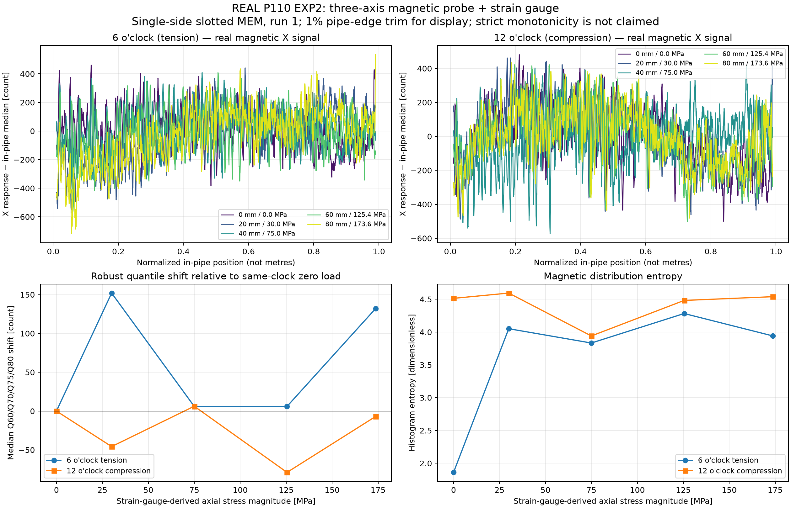
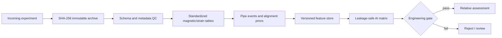
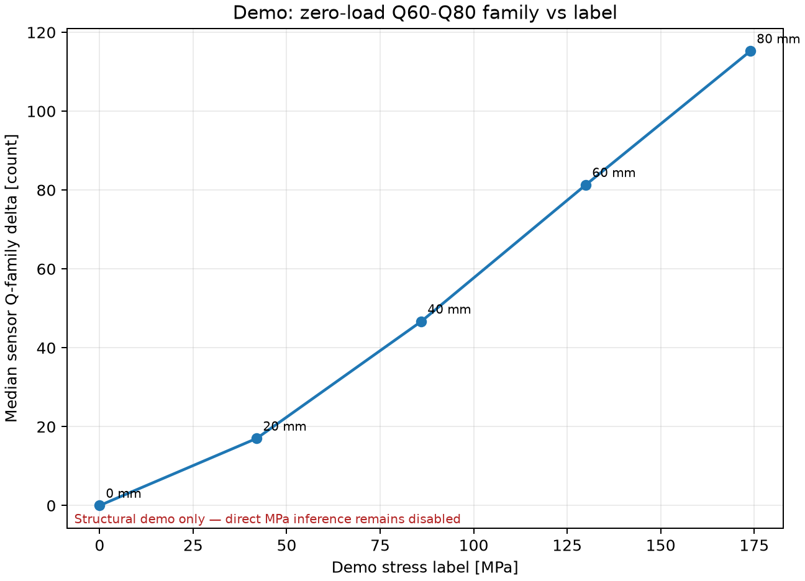

# Pipe Stress Data Platform

[中文说明](README_CN.md) · [Demo](demo/README.md) · [AI data contract](docs/AI_DATA_CONTRACT.md) · [Acquisition SOP](docs/工业采集元数据SOP.md)

A traceable data pipeline for pipeline-stress pull-test research. The current P110 EXP2 release contains **three-axis magnetic sensor data and strain-gauge data only**; it does not contain an independent remanence-signal dataset or eddy-current (ETP) data. The platform architecture can be extended with separate remanence/ETP adapters for other campaigns, but those modalities must not be attributed to this P110 experiment.

The pipeline turns scattered CSV/XLSX/native acquisition files into immutable raw assets, typed Parquet signals, quality-control records, versioned features and leakage-safe AI tables.

> Status: research/engineering foundation. Quantitative MPa output remains fail-closed until a model passes independent-pipe blind validation.

## Real P110 evidence first

The figure below is generated from the **real P110 EXP2 magnetic measurements and strain-gauge-derived stress**, not from synthetic demo data. Only the first and last 1% of the detected in-pipe interval are trimmed for visualization; the frozen feature tables are unchanged.



The curves show genuine load-related distribution changes, together with genuine non-monotonicity. They support stress-sensitive magnetic response, but not a universal direct-MPa calibration.

## Why this repository exists

Real pull-test campaigns often mix sensor files, strain exports, loading notes, repeated stages and manually named folders. That makes it easy to overwrite raw data, align the wrong load stage, reuse blind labels during feature selection, or compare sample-domain frequencies across different pull speeds.

This project makes those failure modes explicit:



## Included capabilities

- Content-addressed immutable raw archive with SHA-256 deduplication.
- Config-driven 3-column and 45-column `Z,Y,X` magnetic layouts.
- Streaming XLSX reader that does not trust incorrect worksheet dimension metadata.
- Explicit sentinel, clipping, channel and primary-feature QC.
- Automatic pipe-entry/exit detection plus head/support geometry priors.
- Robust statistics, entropy, spike metrics, zero-load Q60–Q80 deltas and CDF superiority.
- Separate, versioned stress labels and blind-label access policies.
- CSV + Parquet + SQLite catalogs for MATLAB, Python and AI clients.
- Dataset fingerprinting from raw hashes, configuration, labels and pipeline code.
- Frozen releases and grouped AI split keys to prevent run-level leakage.

## Quick demo

The demo creates a deterministic, de-identified **magnetic-only** P110-like five-stage experiment with the same 45-column `15 sensors × ZYX` layout and separate strain labels. It is structural demonstration data, not field-validation evidence.

```powershell
python -m pip install -e ".[demo]"
python demo/run_demo.py --regenerate
```

Expected outputs:

- five standardized pull scans;
- a QC/event catalog;
- channel and AI feature tables;
- a full SHA-256 validation report;
- signal and stress-feature figures.




## Real P110 case-study result

Modality scope: three-axis magnetic probe signals plus strain-gauge records. No ETP channels are present. Names that describe a magnetizing section or probe condition are experimental hardware labels, not an additional independently acquired remanence modality.

The following figure is generated from the **real P110 EXP2 measurements**, not from the synthetic reader demo. It shows a QC-passing single-side-slotted MEM run at 6 and 12 o'clock. The real data support visible zero/load distribution changes, but they do not justify claiming a strictly monotonic magnetic-to-stress calibration across every stage.

Recreate it after downloading/extracting the private full-data release:

```powershell
python examples/generate_real_p110_case.py --lake path/to/extracted_release
```

The local full-data run used 211 source files:

| Item | Result |
|---|---:|
| Magnetic pulls standardized | 53 |
| Strain files standardized | 18 |
| Strain values standardized | 9,380,688 |
| Channel feature rows | 639 |
| AI sample rows | 53 |
| Integrity/lineage checks | 40/40 passed |
| Unique raw blobs after deduplication | 201 |

The real raw data are deliberately excluded from Git history. For an authorized private deployment, publish the full data lake as a GitHub Release asset or store it in an immutable object store.

## Private full-data release

Authorized collaborators can download the frozen P110 EXP2 package from the private [v0.2.0 release](https://github.com/dctthree/pipe-stress-data-platform/releases/tag/v0.2.0).

| Asset | Size | SHA-256 |
|---|---:|---|
| `P110_EXP2_full_release_1.0.0+97b0dca62768.zip` | 169,639,531 bytes | `38cc098c9a590f05efea429073e7c17c0b2c5f8b0232a7625e50957e05fa6a7c` |

After extraction, start from `dataset_index.json`; do not infer experimental stages by scanning filenames. Validate a local copy before analysis:

```powershell
python run_pipeline.py validate --output path/to/extracted_release --full-hash
```

The Release is a frozen research artifact. Add new experiments through a new configuration and label file, then generate a new dataset version instead of editing the released files.

## Run on a local experiment

1. Copy [configs/experiment_template.json](configs/experiment_template.json).
2. Register the pipe, probe layout, run/stage mapping and signal schema.
3. Keep verified labels in a separate CSV; leave stress blank for blind data.
4. Run:

```powershell
python run_pipeline.py run --config path/to/experiment.json --output lake --snapshot-mode blob
python run_pipeline.py validate --output lake --full-hash
```

The single machine entry point is `lake/dataset_index.json`. AI code should not scan source folders or infer stages from Chinese filenames.

## AI and MATLAB

Python example:

```python
from examples.ai_loader_example import StressDataset

dataset = StressDataset("lake/dataset_index.json")
samples = dataset.supervised_samples()
```

MATLAB R2024b interface:

```matlab
addpath('matlab');
d = loadStressDataset('lake/dataset_index.json');
```

## Important limitations

- Without encoder/speed calibration, `pipe_position_norm` is not a precise metre coordinate.
- Without sampling rate, sample-domain roughness must not be reported as Hz-domain information.
- A clipped primary axis may still be retained for audit or other-axis research, but it cannot pass the primary stress gate.
- Same-pipe repeated experiments show repeatability, not generalization to a new pipe.
- Direct MPa output remains disabled until calibration and independent blind validation are frozen.

## Repository/data boundary

Tracked in Git: source code, schemas, templates, tests, deterministic demo and documentation.

Not tracked in Git: raw customer/experimental files, local absolute-path configs, verified private labels, generated lakes and large release ZIP files.

No open-source license is granted by default. See [NOTICE.md](NOTICE.md).
