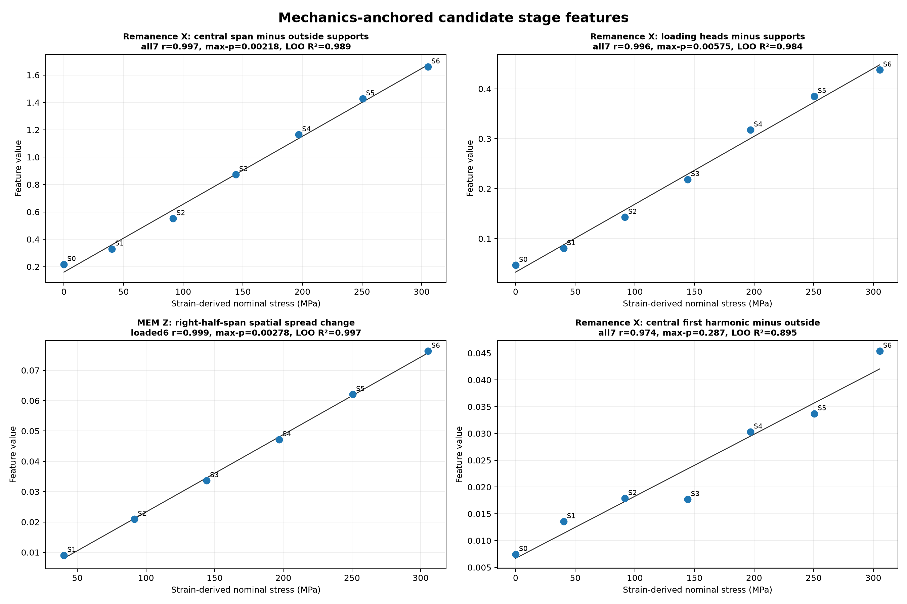
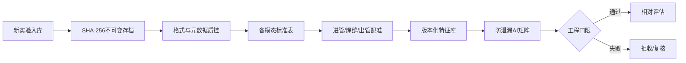

# 管道应力多传感工业数据平台

[English](README.md) · [P110 磁传感+应变案例](case_studies/p110_magnetic_strain/README.md) · [406 三模态案例](case_studies/406_multimodal/README.md) · [演示数据](demo/README.md) · [AI 数据契约](docs/AI_DATA_CONTRACT.md) · [采集 SOP](docs/工业采集元数据SOP.md)

本项目把磁传感、剩磁、涡流 ETP 和应变片牵拉实验整理成可追溯、可增量、可供 MATLAB、Python 和 AI 共用的数据链：原始文件不可变存档，标准信号、质控、特征和标签分别版本化。

> 当前定位是科研与工程基础设施。只有冻结模型通过独立新管道盲测后，系统才允许开放定量 MPa 输出。

## 两个同级真实数据项目

| P110 磁传感 + 应变 | 406 MEM/剩磁/ETP |
|---|---|
| [](case_studies/p110_magnetic_strain/README.md) | [](case_studies/406_multimodal/README.md) |
| **实际数据：**三轴磁传感与应变片；没有独立剩磁采集，也没有 ETP。两轮审查证据目前只支持相对排序，禁止直接输出 MPa。 | **实际数据：**同一磁阵列中的 MEM/剩磁、盲测轮独立 ETP，以及标定轮应变片。当前融合为质控门控，不声称盲测 MPa。 |
| [进入 P110 项目](case_studies/p110_magnetic_strain/README.md) · [真实数据 v0.2.0](https://github.com/dctthree/pipe-stress-data-platform/releases/tag/v0.2.0) · [现场照片](docs/results/field_photos/README.md) | [进入 406 项目](case_studies/406_multimodal/README.md) · [真实数据 v0.3.0](https://github.com/dctthree/pipe-stress-data-platform/releases/tag/v0.3.0) · [现场照片](docs/results/field_photos/406/README.md) |

上面两张卡片都使用真实实验结果，不是合成 Demo。两套实验共用可追溯平台，但各自保留独立的数据边界、配置、结果证据和结论限制。

## 实验范围必须严格区分

| 实验 | 实际包含的数据 | 设计与真值边界 |
|---|---|---|
| P110 EXP2 | 三轴磁传感 + 应变片 | 公开包含两次完整重复；没有独立剩磁数据，也没有 ETP。 |
| 406 标定批次 | 同一磁 CSV 内按物理列奇偶拆分的 MEM/剩磁 + 应变片 | 零载 S0 + 6 个加载状态 S1–S6。MPa 是 `206 GPa × 中位弯曲应变`，不是载荷传感器实测值；该批次没有逐阶段 ETP。 |
| 406 盲测重复 | 同一 MEM/剩磁磁流 + 独立 20 通道复数 ETP | C1、C2 为 S0–S6 完整周期；C3 只有 S0–S2，共 17 个配对包。没有本轮同步应变或 MPa 真值。 |

406 磁 CSV 有 32 个物理列，每列 10 个探头。1-based 奇数物理列为 160 个剩磁通道，偶数物理列为 160 个 MEM 通道。两类磁信号共用同一套 1307 字段 CSV，并非两套独立文件；ETP 才是独立采集的数据流。

## 真实 406 实验证据

### 现场布置

| 406 管道内检测器与试验管段 | 四点弯加载与应变片布置 |
|---|---|
|  |  |

照片只用于说明实验场景，不参与数值分析。公开副本已完成 sRGB 转换、尺寸压缩和元数据清除；来源及第一张背景人员的隐私说明见[现场照片记录](docs/results/field_photos/406/README.md)。

### 应变对应与跨周期复核

下图来自真实 406 标定轮和应变片推导的名义弯曲应力。它能说明开发轮内的力学对应关系，但只有一个标定序列，不能当作独立验证结果。


下图展示盲测重复中实际存在的全部数据包，保留了 C2/S2 的操作员备注与 `REJECT`，也保留了 C3 只有三个状态且幅值尺度不同的事实。


当前最稳妥的工程策略为：

- 剩磁 `MAG-F1-DW-Q90-v1` 是同管、同会话相对排序/变化的主特征。排除预先声明的 C2/S2 质控失败后，C1↔C2 的 Spearman ρ = 1.000、Lin CCC = 0.996、归一化 RMSE = 3.35%。
- MEM `MEM-F4-ZSD-v1` 是必须使用同周期 S0 的无符号辅助复核；严格 C1↔C2 的 CCC = 0.980、归一化 RMSE = 7.51%。
- ETP 候选的负对照响应可与目标响应一样强，因此当前只能做 QC、混杂/负对照告警和研究候选，不能称为应力量值。
- 当前三模态程序实现的是 fail-closed 的模态资格/QC 门控。由于 ETP 未通过整轮门限，结果保持“仅磁相对量”，不生成数值融合值或盲测 MPa。逐阶段跨模态方向冲突评分仍是后续必须增加的门，不是本版本已经实现的结果。

公式、全部派生表、13 张可从盲测原始数据重跑的图，以及 1 张附派生值与重绘程序的冻结标定图，见[406 三模态完整案例](case_studies/406_multimodal/README.md)。

## 真实 P110 证据

P110 EXP2 只有磁探头和应变片数据。探头/文件夹名称中出现“磁化节”或“剩磁”只代表硬件工况，不等于另有一套独立剩磁测量。


在 X 轴专用审查流程中，完整双磁极 MEM 方案的五个预选传感器在两轮中能重复应力排序，但直接拟合斜率仍明显变化。保守的整迹质控与后续 X 轴专用审查给出的状态并不完全相同，因此它仍是探索性相对排序候选，不能称为通用合格通道或直接迁移为 MPa 标定。详见[P110 完整案例](case_studies/p110_magnetic_strain/README.md)和[现场照片说明](docs/results/field_photos/README.md)。

## 平台解决的问题

实际牵拉实验常混合多段 CSV、应变导出、加载记录、重复阶段和人工目录名，容易发生原始数据覆盖、阶段错配、盲测标签泄漏以及把采样点频率误写成 Hz 等问题。



主要能力包括：

- SHA-256 内容寻址、原始数据去重和不可变快照；
- 可配置磁通道布局及 406 奇偶物理列合同；
- 大体量分片 CSV 和 XLSX 流式读取；
- 进管、焊缝、出管地标配准及几何质控；
- 削顶、哨兵值、温度、分片连续性和负对照门限；
- 特征、标签、实验分组和数据指纹分别版本化；
- CSV、Parquet、SQLite、MATLAB 与 Python 接口。

## 公开数据版本

原始实验文件不写入 Git 历史，而是作为不可变 Release 附件公开。

| Release | 内容 | 程序入口 |
|---|---|---|
| [v0.2.0](https://github.com/dctthree/pipe-stress-data-platform/releases/tag/v0.2.0) | P110 EXP2 磁数据与应变片全量包 | ZIP 内的 `dataset_index.json` |
| [v0.3.0](https://github.com/dctthree/pipe-stress-data-platform/releases/tag/v0.3.0) | 406 标定 MEM/剩磁+应变，以及 17 包盲测 MEM/剩磁/ETP | `release_index.json`、`raw_file_manifest.csv`、`SHA256SUMS.txt` |

禁止通过文件名重新猜阶段。必须从公开索引读取，并原样保留缺失阶段和 QC 失败。

## 小型结构演示

仓库内的小 Demo 是确定性、匿名化的 P110 类磁数据，只验证数据管道结构，不是现场实验或应力反演证据。

```powershell
python -m pip install -e ".[demo]"
python demo/run_demo.py --regenerate
```


## 接入本地新实验

1. 复制 [configs/experiment_template.json](configs/experiment_template.json)。
2. 注册管号、探头布局、轮次/阶段映射和信号格式。
3. 真值标签保存在独立 CSV；盲测数据的应力字段留空。
4. 执行：

```powershell
python run_pipeline.py run --config path/to/experiment.json --output lake --snapshot-mode blob
python run_pipeline.py validate --output lake --full-hash
```

AI 程序应只读取 `lake/dataset_index.json`，不要扫描原始目录猜测工况。MATLAB R2024b 接口：

```matlab
addpath('matlab');
d = loadStressDataset('lake/dataset_index.json');
```

## 结论边界

- 同一根管道的重复性不能替代新管道迁移验证。
- 没有编码器和速度核验时，归一化位置不是米制距离。
- 不知道采样率时，采样域粗糙度不能解释成 Hz。
- 主通道 QC 失败不能由另一模态“救回”。
- 相对变化无法从单次扫描辨识总残余应力。
- 只有完成冻结标定、不确定度评估和独立盲测后，才允许开放直接 MPa 输出。

Git 中只保存代码、格式、模板、测试、小型派生表、结果图和说明；原始实验文件与大型压缩包放在 GitHub Releases。项目默认不授予开源许可，详见 [NOTICE.md](NOTICE.md)。
