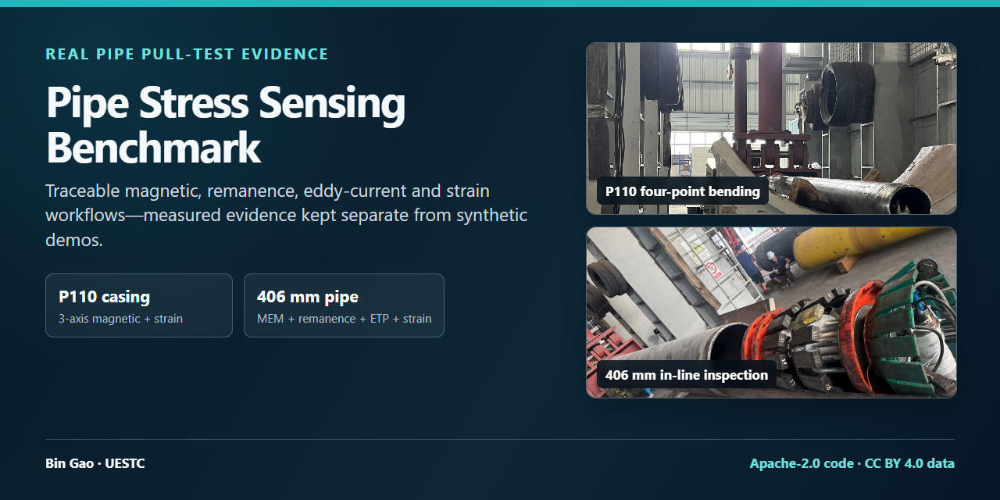
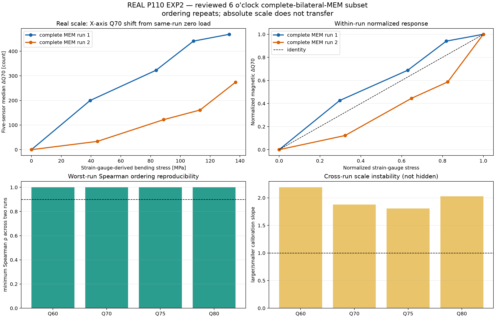
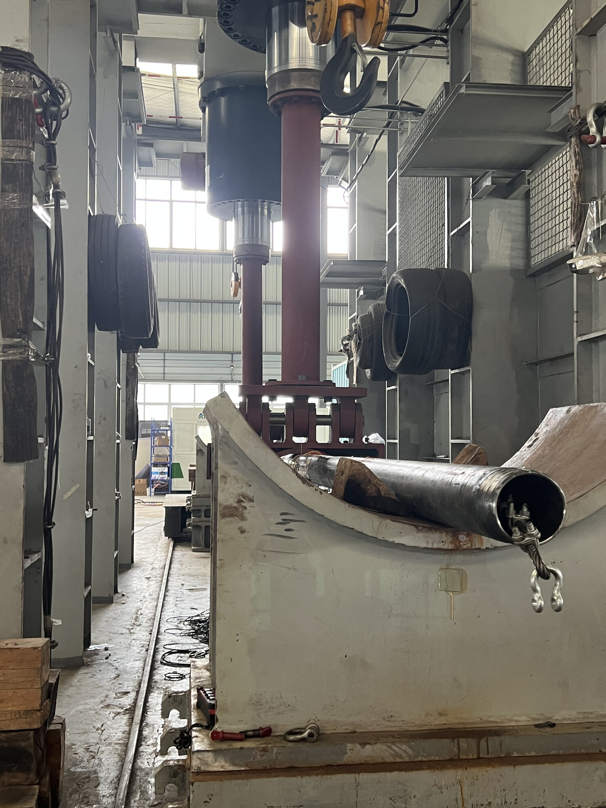
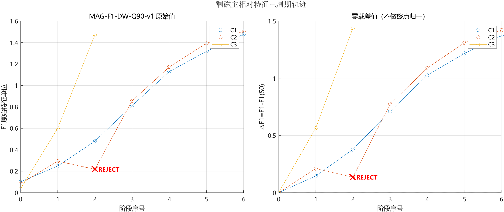
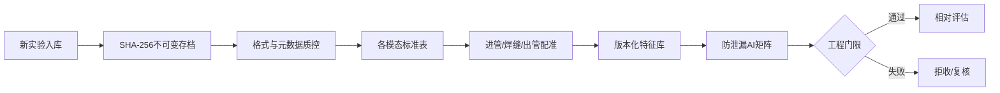
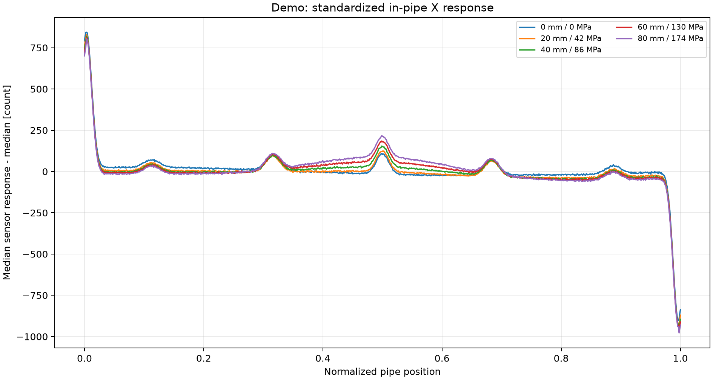

# 管道应力磁感知实验基准与数据平台

[](https://github.com/dctthree/pipe-stress-data-platform/actions/workflows/ci.yml)
[](https://github.com/dctthree/pipe-stress-data-platform/releases/latest)
[](pyproject.toml)
[](matlab/loadStressDataset.m)
[](LICENSE)
[](DATA_LICENSE.md)

**真实牵拉数据 · Python/MATLAB 可复现流程 · 明确限定结论边界**



[English](README.md) · [P110 磁传感+应变案例](case_studies/p110_magnetic_strain/README.md) · [406 三模态案例](case_studies/406_multimodal/README.md) · [演示数据](demo/README.md) · [AI 数据契约](docs/AI_DATA_CONTRACT.md) · [采集 SOP](docs/工业采集元数据SOP.md)

本项目把磁传感、剩磁、涡流 ETP 和应变片牵拉实验整理成可追溯、可增量、可供 MATLAB、Python 和 AI 共用的数据链：原始文件不可变存档，标准信号、质控、特征和标签分别版本化。

> 当前定位是科研与工程基础设施。只有冻结模型通过独立新管道盲测后，系统才允许开放定量 MPa 输出。

## 从这里开始

| 你的目标 | 推荐入口 |
|---|---|
| 查看真实实验和结果证据 | [P110 磁传感+应变](case_studies/p110_magnetic_strain/README.md)或[406 MEM/剩磁/ETP](case_studies/406_multimodal/README.md) |
| 下载冻结的真实数据包 | [P110 v0.2.0](https://github.com/dctthree/pipe-stress-data-platform/releases/tag/v0.2.0)或[406 v0.3.0](https://github.com/dctthree/pipe-stress-data-platform/releases/tag/v0.3.0) |
| 快速验证软件链路 | [确定性结构 Demo](demo/README.md)和[持续集成流程](.github/workflows/ci.yml) |
| 接入一轮新的牵拉实验 | [实验配置模板](configs/experiment_template.json)和[工业采集元数据 SOP](docs/工业采集元数据SOP.md) |
| 反馈复现结果、数据疑问或新方法 | [按模板提交 Issue](https://github.com/dctthree/pipe-stress-data-platform/issues/new/choose)或进入[讨论区](https://github.com/dctthree/pipe-stress-data-platform/discussions) |
| 对外转发且不夸大结论 | [中英文项目推广素材](docs/SHARE_KIT.md) |

> **复用状态：**软件代码按 [Apache-2.0](LICENSE) 正式开源；实验数据、公开表格、结果图和现场照片除非另有说明，均按 [CC BY 4.0](DATA_LICENSE.md) 开放。使用时应引用具体冻结版本。

## 两个同级真实数据项目

| P110 磁传感 + 应变 | 406 MEM/剩磁/ETP |
|---|---|
| [](case_studies/p110_magnetic_strain/README.md) | [](case_studies/406_multimodal/README.md) |
| **实验：**10.54 m P110 套管开展重复四点弯牵拉。公开索引包含 48 次 6 点钟牵拉与 5 次 12 点钟牵拉；当前审查的完整双磁极 MEM 子集全部来自 6 点钟。 | **实验：**406 mm 管道先做四点弯标定，再由内检测器完成两个完整盲测周期 C1/C2 和一个部分周期 C3。 |
| **传感器：**`Z/Y/X` 顺序的三轴磁传感与应变片；当前结果采用完整双磁极 MEM 探头及预选传感器 1/3/4/5/6。没有独立剩磁流，也没有 ETP。 | **传感器：**同一磁 CSV 中拆分的 160 个剩磁与 160 个 MEM 通道、盲测轮独立 20 通道复数 ETP，以及标定轮应变片。 |
| [](case_studies/p110_magnetic_strain/README.md) | [](case_studies/406_multimodal/README.md) |
| **当前证据：**P110 两轮 Q60–Q80 可以重复应力排序，但响应尺度不同，禁止直接输出 MPa。 | **当前证据：**部分磁相对变化候选在声明的 QC 排除后通过同管门限；ETP 仍是研究/QC，不声称盲测 MPa。 |
| [进入 P110 项目](case_studies/p110_magnetic_strain/README.md) · [真实数据 v0.2.0](https://github.com/dctthree/pipe-stress-data-platform/releases/tag/v0.2.0) · [现场照片](docs/results/field_photos/README.md) | [进入 406 项目](case_studies/406_multimodal/README.md) · [真实数据 v0.3.0](https://github.com/dctthree/pipe-stress-data-platform/releases/tag/v0.3.0) · [现场照片](docs/results/field_photos/406/README.md) |

上面两张卡片都使用真实实验结果，不是合成 Demo。两套实验共用可追溯平台，但各自保留独立的数据边界、配置、结果证据和结论限制。

## 实验范围必须严格区分

| 实验 | 实际包含的数据 | 设计与真值边界 |
|---|---|---|
| P110 EXP2 | 三轴磁传感 + 应变片 | 全量包包含五类探头硬件工况和 53 次磁扫描；当前审查的完整双磁极 MEM 子集包含两轮完整重复。没有独立剩磁数据，也没有 ETP。 |
| 406 标定批次 | 同一磁 CSV 内按物理列奇偶拆分的 MEM/剩磁 + 应变片 | 零载 S0 + 6 个加载状态 S1–S6。MPa 是 `206 GPa × 中位弯曲应变`，不是载荷传感器实测值；该批次没有逐阶段 ETP。 |
| 406 盲测重复 | 同一 MEM/剩磁磁流 + 独立 20 通道复数 ETP | C1、C2 为 S0–S6 完整周期；C3 只有 S0–S2，共 17 个配对包。没有本轮同步应变或 MPa 真值。 |

406 磁 CSV 有 32 个物理列，每列 10 个探头。1-based 奇数物理列为 160 个剩磁通道，偶数物理列为 160 个 MEM 通道。两类磁信号共用同一套 1307 字段 CSV，并非两套独立文件；ETP 才是独立采集的数据流。

## P110 实验项目——磁传感 + 应变

### 实验与传感器布置

| P110 四点弯加载台架 | 压头、管体与应变片接线 |
|---|---|
|  |  |

| 组成 | 说明 |
|---|---|
| 管体与加载 | P110 套管长 10.54 m、外径 139.70 mm、壁厚 9.17 mm，开展重复四点弯加载 |
| 牵拉位置 | 公开扫描索引包含 48 次 6 点钟牵拉和 5 次单边开槽 MEM 的 12 点钟牵拉；当前审查的完整双磁极 MEM 数据全部来自 6 点钟拉应力侧 |
| 磁传感器 | CSV 三轴顺序为 `Z/Y/X`；当前审查证据采用完整双磁极 MEM 方案及预选传感器 1/3/4/5/6 |
| 参考测量 | 同步匹配应变片；图中 MPa 为应变片推导量，不是载荷传感器真值 |
| 模态边界 | 只有磁传感输出与应变片；没有 ETP，也没有独立采集的剩磁数据流 |

照片用于直观说明真实实验，不参与数值计算。照片来源与元数据清理记录见[P110 现场照片说明](docs/results/field_photos/README.md)。

### 真实分析结果

下图使用真实的 6 点钟拉应力侧审查子集。探头或文件夹名称中的“磁化节/剩磁”只代表硬件工况，不等于独立剩磁测量模态。


在 X 轴专用审查流程中，完整双磁极 MEM 方案的五个预选传感器在两轮中能重复应力排序，但直接拟合斜率仍明显变化。保守的整迹质控与后续 X 轴专用审查给出的状态并不完全相同，因此它仍是探索性相对排序候选，不能称为通用合格通道或直接迁移为 MPa 标定。详见[P110 完整案例](case_studies/p110_magnetic_strain/README.md)和[P110 v0.2.0 数据](https://github.com/dctthree/pipe-stress-data-platform/releases/tag/v0.2.0)。

## 406 实验项目——MEM/剩磁/ETP

### 现场布置

| 406 管道内检测器与试验管段 | 四点弯加载与应变片布置 |
|---|---|
|  |  |

照片只用于说明实验场景，不参与数值分析。公开副本已完成 sRGB 转换、尺寸压缩和元数据清除；来源及第一张背景人员的隐私说明见[现场照片记录](docs/results/field_photos/406/README.md)。

| 组成 | 说明 |
|---|---|
| 管体与加载 | 406 mm 管道开展四点弯标定，随后由内检测器完成完整盲测周期 C1/C2 和部分周期 C3 |
| 磁阵列 | 32 个物理列 × 每列 10 个测点；同一 CSV 的一基奇数列组成 160 个剩磁通道，偶数列组成 160 个 MEM 通道 |
| ETP | 盲测重复中独立采集的 20 通道复数涡流数据流 |
| 参考测量 | 标定实验含应变片；盲测周期没有同期应变或 MPa 真值 |
| 融合边界 | 失败闭锁的模态/QC 门控；不生成数值融合值，也不输出盲测 MPa |

### 应变对应与跨周期复核

下图来自真实 406 标定轮和应变片推导的名义弯曲应力。它能说明开发轮内的力学对应关系，但只有一个标定序列，不能当作独立验证结果。


下图展示盲测重复中实际存在的全部数据包，保留了 C2/S2 的操作员备注与 `REJECT`，也保留了 C3 只有三个状态且幅值尺度不同的事实。



当前最稳妥的工程策略为：

- 剩磁 `MAG-F1-DW-Q90-v1` 是同管、同会话相对排序/变化的主特征。排除预先声明的 C2/S2 质控失败后，C1↔C2 的 Spearman ρ = 1.000、Lin CCC = 0.996、归一化 RMSE = 3.35%。
- MEM `MEM-F4-ZSD-v1` 是必须使用同周期 S0 的无符号辅助复核；严格 C1↔C2 的 CCC = 0.980、归一化 RMSE = 7.51%。
- ETP 候选的负对照响应可与目标响应一样强，因此当前只能做 QC、混杂/负对照告警和研究候选，不能称为应力量值。
- 当前三模态程序实现的是 fail-closed 的模态资格/QC 门控。由于 ETP 未通过整轮门限，结果保持“仅磁相对量”，不生成数值融合值或盲测 MPa。逐阶段跨模态方向冲突评分仍是后续必须增加的门，不是本版本已经实现的结果。

公式、全部派生表、13 张可从盲测原始数据重跑的图，以及 1 张附派生值与重绘程序的冻结标定图，见[406 三模态完整案例](case_studies/406_multimodal/README.md)。

## 平台解决的问题

实际牵拉实验常混合多段 CSV、应变导出、加载记录、重复阶段和人工目录名，容易发生原始数据覆盖、阶段错配、盲测标签泄漏以及把采样点频率误写成 Hz 等问题。



主要能力包括：

- SHA-256 内容寻址、原始数据去重和不可变快照；
- 可配置磁通道布局及 406 奇偶物理列合同；
- 大体量分片 CSV 和 XLSX 流式读取；
- 进管、焊缝、出管地标配准及几何质控；
- 削顶、哨兵值、温度、分片连续性和负对照门限；
- 特征、标签、实验分组和数据指纹分别版本化；
- CSV、Parquet、SQLite、MATLAB 与 Python 接口。

## 公开数据版本

原始实验文件不写入 Git 历史，而是作为不可变 Release 附件公开。

| Release | 内容 | 程序入口 |
|---|---|---|
| [v0.2.0](https://github.com/dctthree/pipe-stress-data-platform/releases/tag/v0.2.0) | P110 EXP2 磁数据与应变片全量包 | ZIP 内的 `dataset_index.json` |
| [v0.3.0](https://github.com/dctthree/pipe-stress-data-platform/releases/tag/v0.3.0) | 406 标定 MEM/剩磁+应变，以及 17 包盲测 MEM/剩磁/ETP | `release_index.json`、`raw_file_manifest.csv`、`SHA256SUMS.txt` |

禁止通过文件名重新猜阶段。必须从公开索引读取，并原样保留缺失阶段和 QC 失败。

## 小型结构演示

仓库内的小 Demo 是确定性、匿名化的 P110 类磁数据，只验证数据管道结构，不是现场实验或应力反演证据。

```powershell
python -m pip install -e ".[demo]"
python demo/run_demo.py --regenerate
```



## 接入本地新实验

1. 复制 [configs/experiment_template.json](configs/experiment_template.json)。
2. 注册管号、探头布局、轮次/阶段映射和信号格式。
3. 真值标签保存在独立 CSV；盲测数据的应力字段留空。
4. 执行：

```powershell
python run_pipeline.py run --config path/to/experiment.json --output lake --snapshot-mode blob
python run_pipeline.py validate --output lake --full-hash
```

AI 程序应只读取 `lake/dataset_index.json`，不要扫描原始目录猜测工况。MATLAB R2024b 接口：

```matlab
addpath('matlab');
d = loadStressDataset('lake/dataset_index.json');
```

## 结论边界

- 同一根管道的重复性不能替代新管道迁移验证。
- 没有编码器和速度核验时，归一化位置不是米制距离。
- 不知道采样率时，采样域粗糙度不能解释成 Hz。
- 主通道 QC 失败不能由另一模态“救回”。
- 相对变化无法从单次扫描辨识总残余应力。
- 只有完成冻结标定、不确定度评估和独立盲测后，才允许开放直接 MPa 输出。

## 引用与许可证

项目作者为 **Bin Gao，电子科技大学（UESTC）**。GitHub 的“Cite this repository”入口读取 [CITATION.cff](CITATION.cff)，供 Zenodo 使用的元数据见 [.zenodo.json](.zenodo.json)。

- 软件代码：[Apache License 2.0](LICENSE)
- 实验数据、表格、结果图、照片和数据说明：[CC BY 4.0](DATA_LICENSE.md)
- 推荐署名：`Gao, Bin (2026). Pipe Stress Sensing Benchmark & Data Platform. UESTC.`，并附仓库链接、冻结版本号和校验值/数据指纹。

Git 中只保存代码、格式、模板、测试、小型派生表、结果图和说明；原始实验文件与大型压缩包放在 GitHub Releases，并采用同一数据许可证及各版本声明的证据边界。
