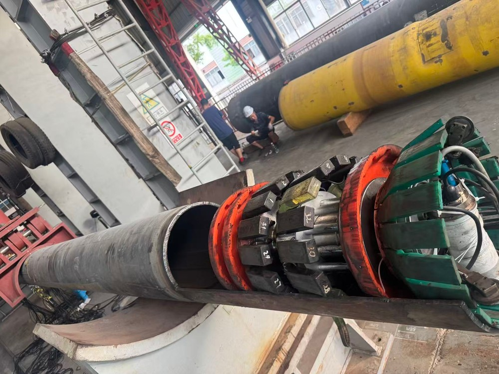
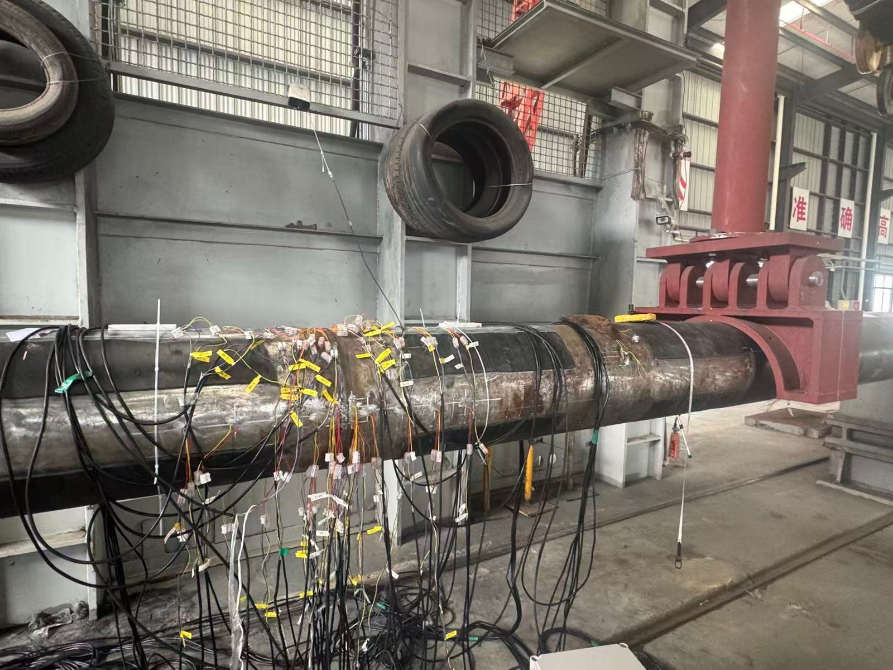
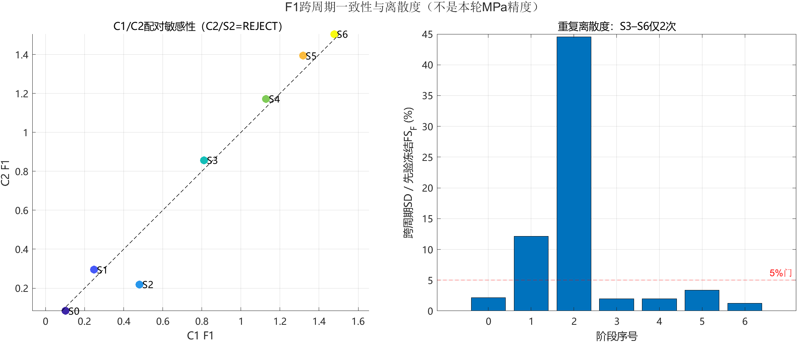
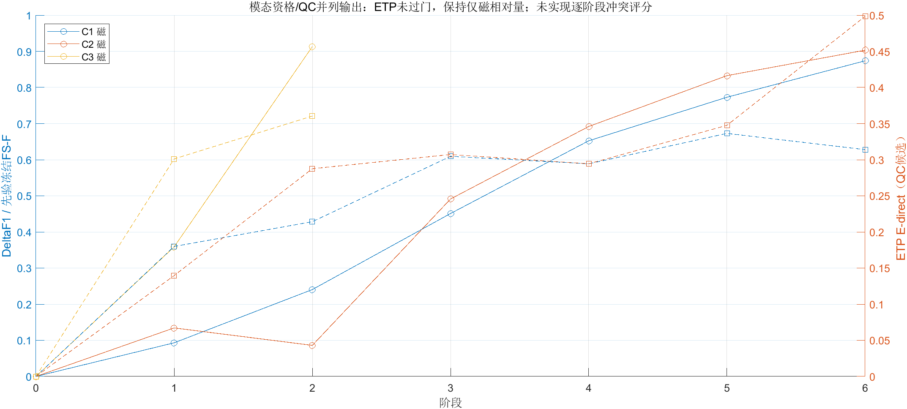

# 406 管道 MEM—剩磁—ETP 三模态案例 / 406-pipe MEM–remanence–ETP case study

本目录公开 406 管道牵拉实验的可追溯 MATLAB 程序、冻结派生表和真实分析图。原始 CSV 体量较大，作为 [GitHub Release v0.3.0](https://github.com/dctthree/pipe-stress-data-platform/releases/tag/v0.3.0) 数据资产分发；普通 Git 目录保留代码、配置、QC 记录和可复核结果。

This directory publishes the traceable MATLAB workflow, frozen derived tables, and real analysis figures for the 406-pipe pull tests. The large raw CSV files are distributed as GitHub Release data assets; the normal Git tree keeps code, configuration, QC evidence, and reviewable results.

## 现场实验与传感器 / Field experiment and sensors

| 406 管道内检测器与试验管段 / In-line inspection tool | 四点弯加载与应变片布置 / Four-point bending and strain gauges |
|---|---|
|  |  |

| 组成 / Component | 说明 / Description |
|---|---|
| 实验 / Experiment | 406 mm 管道四点弯标定，以及内检测器完整盲测周期 C1/C2 和部分周期 C3 / Four-point-bending calibration plus complete blind cycles C1/C2 and partial cycle C3 |
| 磁阵列 / Magnetic array | 同一 1307 字段 CSV 中按物理列拆分 160 个剩磁与 160 个 MEM 通道 / 160 remanence and 160 MEM channels separated by physical-column parity from one shared CSV |
| 涡流 / ETP | 盲测轮独立采集的 20 通道复数涡流数据 / Independent 20-channel complex eddy-current stream in blind repeats |
| 应变 / Strain | 标定实验含应变片；盲测周期没有同期应变或 MPa 真值 / Strain gauges are available in calibration, not as contemporaneous blind truth |

照片只提供真实设备与实验布置背景，不参与特征计算；来源、公开处理和隐私说明见[照片记录](../../docs/results/field_photos/406/README.md)。The photographs are physical context only and are not numerical analysis inputs.

## 1. 实验设计与数据边界 / Experimental design and data boundary

- 先验标定批次包含 `S0` 零载和六个加载阶段。该批次的应变信息用于形成候选特征与冻结分析边界。
- 本目录的盲测结果使用三个重复周期：`C1=S0–S6`、`C2=S0–S6`、`C3=S0–S2`，合计 `7+7+3=17` 个有效周期×阶段数据包。C3 缺失的 S3–S6 不插值、不补齐。
- 盲测处理没有读取同期应变或应力真值，因此不能计算盲测 MAE/RMSE，也不能声称输出绝对应力 MPa。
- `C2/S2` 的现场记录指出焊缝不在中间位置；该包保留在图和敏感性分析中，但最终磁 QC 为 `REJECT`，不进入主重复性汇总。

- The prior calibration batch contains unloaded `S0` plus six loading stages. Its strain evidence was used to form candidate features and freeze analysis boundaries.
- The blind snapshot contains `C1=S0–S6`, `C2=S0–S6`, and the partial `C3=S0–S2`: `7+7+3=17` cycle-stage packets. Missing C3 stages are neither imputed nor interpolated.
- No contemporaneous strain or stress truth is read during the blind analysis. Consequently, blind MAE/RMSE and absolute stress in MPa are not available.
- The operator note for `C2/S2` says that the weld was not centered. The packet remains visible for sensitivity review, but its magnetic QC is `REJECT` and it is excluded from the primary repeatability summary.

## 2. 三类信号的真实关系 / What the three signal groups actually are

| 信号 / Signal | 原始结构 / Raw structure | 本案例中的角色 / Role in this case |
|---|---|---|
| 剩磁 / remanence | 与 MEM 共存在同一份 1307 列磁 CSV；按物理列的一基奇数列拆分 | `MAG-F1-DW-Q90-v1`，同一 406 管道上的主要相对排序量 |
| MEM | 与剩磁共存在同一份 1307 列磁 CSV；按物理列的一基偶数列拆分 | `MEM-F4-ZSD-v1`，必须有同周期 S0 的无符号辅助复核 |
| ETP 涡流 / eddy current | 独立采集的 20 个复数通道 | 地标/QC 和研究候选；本数据尚未通过预设应力量门槛 |

MEM 与剩磁并不是两套独立文件或两个可独立重复的测量批次。磁数据与 ETP 只按“周期 + 阶段”配对，并分别通过进管、焊缝、出管三地标完成空间配准，不能按原始采样点直接逐点相加。

MEM and remanence are **not** two independent files or independently repeated acquisitions. They are separated by frozen physical-column parity from the same 1307-column magnetic CSV. Magnetic and ETP data are paired only by cycle and stage, and each modality is registered independently using entry, weld, and exit landmarks; raw sample indices must not be added point by point.

## 3. 冻结结论 / Frozen conclusions

核心实现先把进管、焊缝和出管配准到统一坐标。剩磁主剖面及双侧参考特征为：

```text
r(x) = Q0.90{Brem-X,j(x)},  j = 1...160
F1 = median_T r(x) - wL·median_L r(x) - wR·median_R r(x)
wL = (xR-xT)/(xR-xL),  wR = 1-wL
ΔF1 = F1(stage) - F1(S0 in the same cycle)
```

其中 `T` 是压头/中心目标区，`L/R` 是双侧外参考区；距离权重会抵消加性常量和一阶轴向漂移。MEM 辅助量从160个 MEM-Z 通道的空间离散度变化构造：

```text
D_MEM(x) = STD_j{MEM-Z_stage,j(x)} - STD_j{MEM-Z_S0,j(x)}
MEM-F4 = RMS of D_MEM(x) in the frozen auxiliary window
```

ETP 先在复数域构造 `Zj(x)=Aj(x)·exp(i·φj(x))`，再计算目标区相对参考区的复差；焊缝、管外和温度特征始终作为负对照共同过门，不能只挑选趋势最好的一列。

The implementation first registers pipe entry, weld, and pipe exit. `MAG-F1` applies a 90th-percentile aggregation across 160 remanence-X channels and a distance-weighted two-sided reference contrast. `MEM-F4` is the same-cycle-S0 change in the spatial spread of 160 MEM-Z channels. ETP is processed as the complex quantity `A·exp(iφ)` and must pass its weld/outside/temperature negative-control gates.

| 特征 / Feature | 当前等级 / Current status | 允许用途 / Allowed use | 禁止外推 / Prohibited claim |
|---|---|---|---|
| `MAG-F1-DW-Q90-v1` | `B_RELATIVE_ORDER_ONLY_SCALE_DRIFT_OR_QC_EXCLUSION` | 同管阶段相对排序和目标—参考变化 | 绝对 MPa；跨管直接套用 |
| `MEM-F4-ZSD-v1` | `CONDITIONAL_S0_AUXILIARY_SCALE_NOT_QUALIFIED` | 同周期 S0 辅助复核 | 有符号应力或绝对 MPa |
| `ETP-E1/E2/EDIRECT` | QC/研究候选 | 涡流形态、漂移与整轮负对照资格检查 | 独立应力量或绝对 MPa |
| `MULTIMODAL-GATED-v1` | 模态资格/QC门控 | 未通过门限时保持仅磁相对量或建议复测 | 数值融合值、逐阶段冲突分数或“多模态 MPa” |

`MAG-F1` 在 C1 全部 7 点、C2 排除 S2 后的 6 点以及 C3 的 S0–S2 上均保持单调排序；但低载跨周期尺度离散超过冻结的 5% 门槛，所以只能保留为相对量。`MEM-F4` 作为同周期零载基线辅助。ETP 的部分候选轨迹有趋势，但焊缝、管外和温度负对照影响更强，故本版本仅作 QC/研究用途。

当前实现是 fail-closed 的模态资格/QC门控：ETP 未通过整轮及负对照门限，因此所有接收包都保持“仅磁相对量”。逐阶段 MEM—剩磁—ETP 方向一致性/冲突分数仍是后续必须实现的门，本版本没有计算该分数，也没有数值融合或绝对 MPa。

The implemented fusion is fail-closed **modality/QC eligibility gating**: `MAG-F1` is the primary same-pipe relative indicator, array/shape QC and `MEM-F4` are supporting checks, and ETP must pass its cohort and negative-control gates before it can be promoted. ETP fails those gates in this snapshot, so every accepted packet remains magnetic-relative-only. An explicit stagewise MEM–remanence–ETP direction/conflict score is still a required future gate; it is not implemented here. This snapshot performs no weighted average, regression fusion, or other numeric fusion, and produces no absolute MPa value.

## 4. 目录 / Layout

```text
406_multimodal/
├── config/406_release.example.json
├── matlab/
│   ├── +blind406/*.m
│   ├── run_blind406_demo.m
│   ├── run_blind406_tests.m
│   ├── plot_calibration_feature_trends.m
│   └── export_simple_feature_profiles.m
├── results/latest/
│   ├── *.csv
│   ├── analysis_summary.json
│   ├── 结论说明.md
│   └── figures/*.png
├── results/calibration/
│   ├── calibration_stage_labels.csv
│   ├── calibration_feature_values.csv
│   ├── calibration_feature_metrics.csv
│   └── 07_physical_contrast_trends.png
├── release/
│   ├── DATASET_CARD.md
│   ├── channel_schema.csv
│   ├── raw_file_manifest.csv
│   ├── release_index.json
│   └── SHA256SUMS.txt
├── validate_case.py
└── README.md
```

运行时目录 `runtime/` 被本案例的 `.gitignore` 排除，程序不会覆盖仓库内的冻结结果。

The ignored `runtime/` directory receives regenerated cache and outputs, so a run does not overwrite the frozen public snapshot.

## 5. 从 Release 原始数据复现 / Reproduce from Release raw data

1. 下载 [406 multimodal v0.3.0 Release](https://github.com/dctthree/pipe-stress-data-platform/releases/tag/v0.3.0) 的 8 个原始数据 ZIP，并先按 `release/SHA256SUMS.txt` 校验；以 `release/release_index.json` 和 `release/raw_file_manifest.csv` 为阶段/QC真源。
2. 将资产解压到本目录并保留路径，最终应得到：

   ```text
   raw/blind/C1/magnetic/零压力测试/*.csv
   raw/blind/C1/etp/零压力测试/*.csv
   raw/blind/C2/magnetic/第二次加压/Readme.txt
   raw/blind/C2/etp/第二次加压/*.csv
   raw/blind/C3/magnetic/零压力测试/*.csv
   raw/blind/C3/etp/零压力测试/*.csv
   ```

3. 在 MATLAB R2024b 或兼容版本中运行：

   ```matlab
   cd('case_studies/406_multimodal/matlab')
   results = run_blind406_demo;
   run_blind406_tests;
   ```

   默认配置由 `../config/406_release.example.json` 加载。首次运行会流式读取约 10.2 GiB 磁 CSV 和约 146 万行 ETP 数据，并在 `../runtime/cache/` 建立可失效校验的缓存；派生结果写入 `../runtime/results/latest/`。

4. 只检查仓库冻结结果、无需 MATLAB 或原始数据时运行：

   ```powershell
   python case_studies/406_multimodal/validate_case.py
   ```

Download all 406 raw-data Release parts, extract them while preserving the paths shown above, then run the two MATLAB entry points. The first run streams approximately 10.2 GiB of magnetic CSV data and 1.46 million ETP rows, builds a fingerprinted cache under `runtime/cache/`, and writes regenerated outputs under `runtime/results/latest/`. The Python validator checks the frozen public evidence without MATLAB or third-party packages.

盲测 17 包的特征提取与图表可从 Release 原始数据完整重跑。标定图属于早期开发流水线的冻结证据；本目录公开其 28 行真实派生值、4 行统计量以及独立重绘函数，执行 `plot_calibration_feature_trends` 可在 `runtime/results/calibration/` 重绘，但本版本不声称已把早期标定原始特征提取器迁移到当前 MATLAB 入口。

The 17 blind packets can be fully reprocessed from the Release raw data. The calibration panel is frozen evidence from the earlier development pipeline: its 28 real derived values, four metric rows, and an independent MATLAB redraw function are published here. Run `plot_calibration_feature_trends` to regenerate it under `runtime/results/calibration/`; this release does not claim that the earlier raw-calibration extractor has been ported into the current MATLAB entry point.

冻结表 `results/latest/source_stage_manifest.csv` 和 `magnetic_fragment_qc.csv` 中的路径字段已从发布前本地目录布局机械迁移为上述 Release 规范路径；数值特征、QC 数值与判级均未在该迁移中重算。公开原始文件的字节级身份以 `release/raw_file_manifest.csv` 中逐文件 SHA-256 为准；`analysis_summary.json` 中旧缓存的 `sourceFingerprint` 只是发布前本地缓存失效键，不是公开原始数据完整性标识。

The path columns in the frozen `source_stage_manifest.csv` and `magnetic_fragment_qc.csv` tables were mechanically migrated from the pre-release local layout to the canonical Release layout above. No numerical feature, QC value, or decision was recomputed during that provenance-only migration. Per-file SHA-256 values in `release/raw_file_manifest.csv` define the public raw-byte identity; the legacy cache `sourceFingerprint` in `analysis_summary.json` is only a pre-release local cache-invalidation key, not a public raw-data integrity identifier.

公开副本在 MATLAB R2024b 中完成了配置解析，并对冻结结果执行 9/9 回归测试：奇偶物理列、42行预期清单/17对可用包、C2/S2警告、双侧参考几何、7/7/3不平衡设计、F1与ETP回归值、无数值融合以及图表/摘要完整性均通过。Code Analyzer检查当前18个M文件时只有9条样式/兼容性建议，没有阻断性语法诊断。该快速回归复用冻结结果；下载原始Release后的首次运行才会重建全部盲测特征缓存。

The public copy passed 9/9 frozen-result regression tests in MATLAB R2024b. Code Analyzer reported nine non-blocking style/compatibility advisories across the current 18 M-files and no blocking syntax condition. This fast regression reuses the frozen result artifact; a first run after downloading the raw Release rebuilds the full blind feature cache.

## 6. 真实结果图 / Real result figures

以下图来自 406 三周期真实数据，不是合成曲线。

The figures below are generated from the real three-cycle 406 data; they are not synthetic curves.

标定轮的应变片推导名义应力与磁特征关系如下。它是开发轮证据，不是独立重复精度；对应数值见 `results/calibration/calibration_stage_labels.csv`。

The calibration relationship below uses strain-derived nominal stress from one development sequence. It is not an independent-repeat accuracy claim.






## 7. 工程解释限制 / Engineering interpretation limits

- 这是同一实验管道的相对应力响应与 QC 证据，不是现场通用绝对应力仪。
- 两个完整周期加一个不完整周期不足以完成正式三重复 G1 资格认定。
- 在输出 MPa 前，仍需至少一个完整的随机加载周期、同步应变真值、独立管段/跨管验证，以及提离、速度、温度和磁历史的分层试验。
- ETP 的相位单位仍是待硬件确认的假设，不应据此作绝对应力解释。

- This is same-pipe relative-response and QC evidence, not a field-universal absolute-stress instrument.
- Two complete cycles plus one partial cycle do not qualify formal three-repeat G1 repeatability.
- Absolute MPa requires at least one additional complete randomized cycle with synchronized strain truth, independent pipe/segment validation, and stratified lift-off, speed, temperature, and magnetic-history tests.
- The ETP phase unit remains a hardware assumption and must not be used for absolute-stress interpretation.
