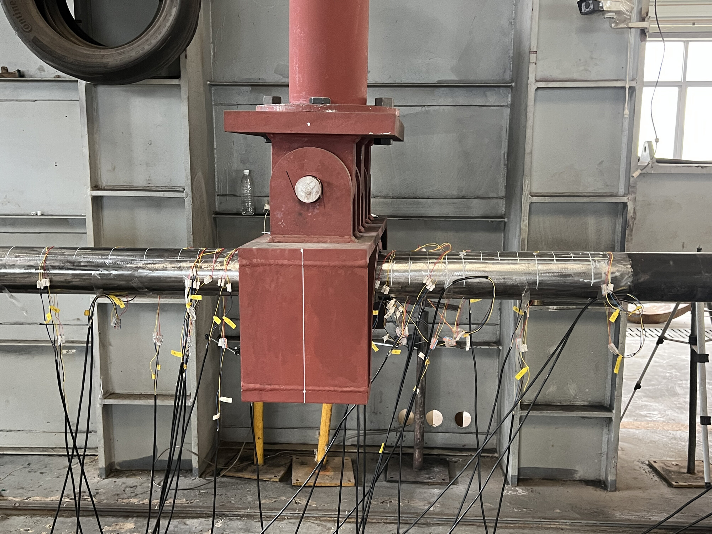

# Real-data case studies / 真实数据案例

The repository keeps one shared traceable data platform and two first-class experimental cases. Their modalities and scientific claims are intentionally separate.

| Case | Real experiment | Sensors and frozen conclusion | Entry |
|---|---|---|---|
| P110 EXP2 |  | Three-axis magnetic sensors + strain gauges; no independent remanence and no ETP. Reviewed Q60–Q80 candidates repeat ordering but not absolute scale; relative ordering only. | [P110 magnetic + strain](p110_magnetic_strain/README.md) · [v0.2.0](https://github.com/dctthree/pipe-stress-data-platform/releases/tag/v0.2.0) |
| 406 |  | Shared 160-channel MEM/160-channel remanence magnetic array + calibration strain; independent 20-channel ETP in blind repeats. ETP remains research/QC; no blind MPa. | [406 multimodal](406_multimodal/README.md) · [v0.3.0](https://github.com/dctthree/pipe-stress-data-platform/releases/tag/v0.3.0) |

本仓库保留一套共用的数据治理代码，同时把 P110 和 406 作为两个同级项目展示。P110 只有磁传感与应变片；406 才包含 MEM、剩磁和独立 ETP 盲测流。两者均不声称已经具备跨新管道的直接 MPa 输出能力。
