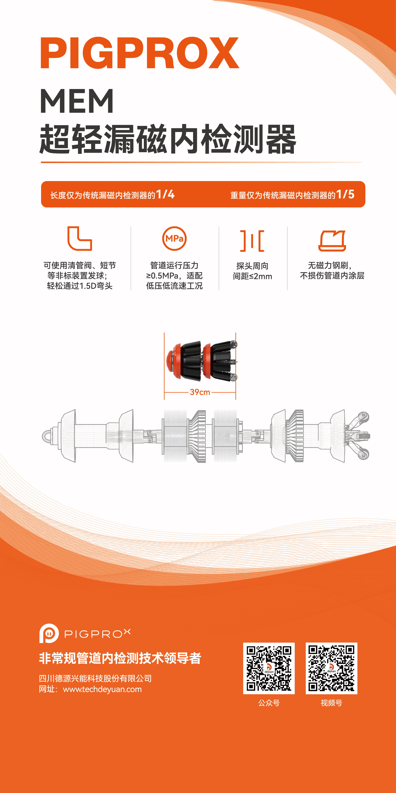

# PIGPROX product materials / 产品资料

[Related publications](../RELATED_PUBLICATIONS.md) · [Project evidence](../../README.md) · [中文首页](../../README_CN.md)

This folder keeps owner-supplied product collateral separate from experimental evidence. It gives readers a direct view of the compact electromagnetic in-line-inspection hardware and product positioning, but the brochure’s specifications and product claims are not treated as measurements from the P110 or 406-mm stress experiments.

本目录将项目方提供的产品宣传资料与实验数据、结果图严格分开。资料可帮助读者直观了解紧凑型电磁管道内检测器及应用场景，但画册中的指标和产品表述不能替代 P110 或 406 mm 应力实验的独立验证。

## Eddy-current in-line-inspection brochure / 涡流内检测英文画册

- [Download the original 12-page English PDF (52.6 MB)](https://github.com/dctthree/pipe-stress-data-platform/releases/download/product-materials-2026-08/PIGPROX-English-Eddy-Current-ILI-Brochure.pdf)
- Scope shown in the brochure: compact eddy-current ILI tools, differential eddy-current sensing, tracking software, inspection functions, technical indexes and application cases.
- The PDF was visually checked page by page before publication; the preview above is a rasterized first page for browser display.

## MEM ultralight MFL detector / MEM 超轻漏磁内检测器

- [Open or download the full-resolution poster](PIGPROX_MEM_ultralight_MFL_detector.jpg)
- The poster presents the compact MEM magnetic-flux-leakage product configuration and manufacturer-stated operating features.
- “MEM” here is a product/sensor designation; it should not be confused with an independently acquired remanence stream in the P110 experiment. P110 contains magnetic data and strain-gauge references only.

## Provenance, integrity and rights / 来源、完整性与权利

| File | Distribution | SHA-256 |
|---|---|---|
| `PIGPROX-English-Eddy-Current-ILI-Brochure.pdf` | GitHub Release asset | `5ce81f911a344d9f8bc9807a3b174cba74ab2a3f836710b816536fe3d30705e8` |
| `PIGPROX_MEM_ultralight_MFL_detector.jpg` | Repository file | `bdb8a822c4ffa3c39a6667e524b009862a8a74a8bd42d2ffe4742f71e2c7628f` |
| `PIGPROX_eddy_current_ILI_brochure_preview.png` | Derived browser preview | `0f69b0746ea6201a1f85e734aaac55a16eb67a0226f8f51fe7b7c6be4fa4eb12` |

The source PDF and poster were supplied by the project owner for public product presentation. Product names, trademarks, layouts, photographs and manufacturer claims remain subject to their respective owner’s rights. These product materials are **not** covered by the repository’s Apache-2.0 software licence or CC BY 4.0 experimental-data licence unless a separate written licence states otherwise.

原始 PDF 与海报由项目方提供并授权用于公开产品展示。产品名称、商标、版式、照片及厂商性能表述的权利仍归各自权利人；除非另有书面许可，本目录产品资料不自动适用仓库的 Apache-2.0 代码许可证或 CC BY 4.0 实验数据许可证。
